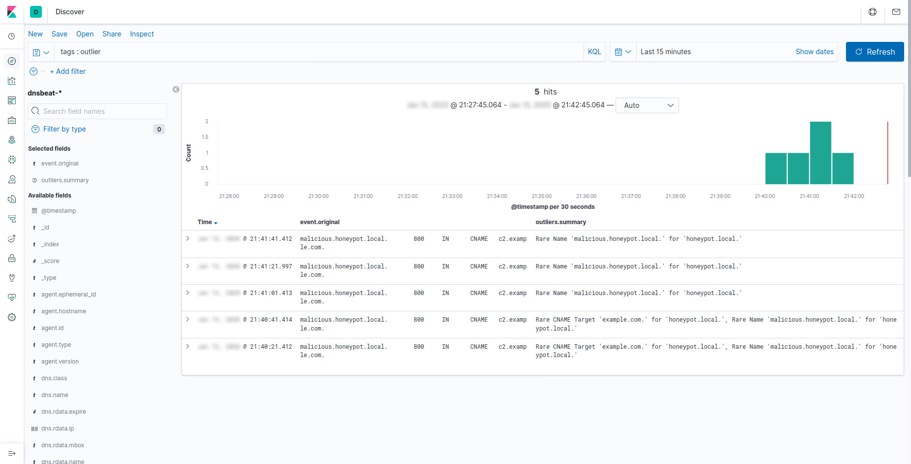

# Dnsbeat Proof-of-Concept

## Set-Up

This proof-of-concept relies on [Docker Compose](https://docs.docker.com/compose/).

```bash
git clone https://github.com/0xThiebaut/dnsbeat-poc
cd dnsbeat-poc
docker-compose up -d
```

## Usage

As soon as the environment is up and spinning, have a look around the Kibana dashboards at [`localhost:5601`](http://localhost:5601/).

The Elastic statistical analysis tool [ee-outliers](https://github.com/NVISO-BE/ee-outliers) is included in this proof-of-concept.
As we need some baseline for such an analysis, go have a coffee and **take 20 minutes** to enjoy life...

### Outlier Generation

This proof-of-concept honeypot is vulnerable to malicious dynamic updates.
Go ahead and use `nsupdate` to inject a malicious entry.

```bash
nsupdate
```

Once you are running the dynamic DNS update utility, inject your malicious entries into the server.
To do so, you will need to select our vulnerable DNS server after which you can use the `update` command to add an entry.

```bash
server 127.0.0.1 5053
update add malicious.honeypot.local 800 CNAME c2.example.com.
send
quit
```

### Outlier Detection

After ee-outliers has run, which can take up to a minute, you may now find the malicious entry by searching for events tagged as *"outlier"*.



## Tear-Down

```bash
docker-compose down -v
```
